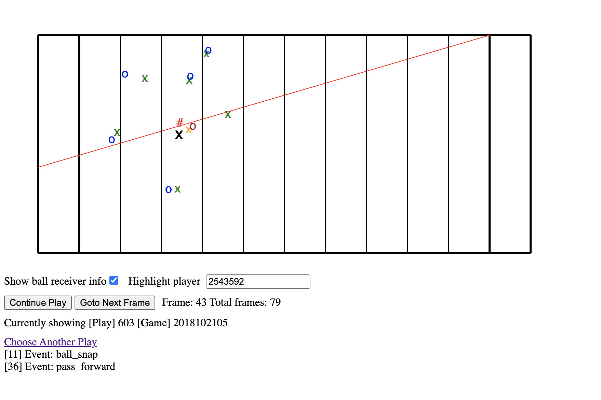

# Nodejs visualizer for NFL kaggle problem

**Legend**

o - offense

x - defense

green x  - defense team is home team

blue o - offense team is away team

# - ball

brown o - predicted ball receiver

orange x - defendent close to ball receiver

black x - highlighted player

red line - expected trajectory of ball pass

## Input config sample

	{
		"folder": "/workspace/output_events/weekx",
		"receiverFile": "/workspace/output_br/weekx.json"
	}

* The events folder is generated by the ***get-nfl-info.py*** script in the scripts folder, for a particular week of data
* The receiver json file is chosen for the corresponding week. The receiver json file is generated by the ***find-ball-receiver.py*** script in the **nfl-kaggle** repository

## How to run the visualizer

In the js folder, run the following command

	npm start

The visualizer can be viewed in browser using the link

	http://localhost:8080/

Sample game, play name for week 7 data:

	game: 2018102105
	play: 603

